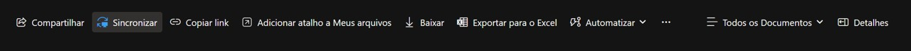

# comex-stat

## Visão geral

Este repositório automatiza o download de dados brutos da base Comex Stat e organiza os dados em uma base no diretório **database** deste projeto ou, alternativamente, em um diretório do OneDrive. Apenas algumas variáveis da base do Comex Stat são selecionadas para montar a base: ano, mês, unidade da federação, código NCM, país, valores em dólares FOB (para importações também temos valores em dólares CIF), peso em quilogramas líquidos e quantidade estatística. Os nomes das colunas da base são os seguintes:

-   co_ano (ano)
-   co_mes (mês)
-   no_uf (nome da unidade da federação)
-   co_ncm (código NCM)
-   no_pais (nome do país)
-   vl_fob (valor em dólares fob)
-   vl_cif (valor em dólares cif)
-   kg_liquido (peso em quilogramas líquido)
-   qt_estat (quantidade estatística)

Para facilitar as consultas, optou-se por trazer na base o nome do país, em vez de trazer o código do país.

## Objetivo

O objetivo do repositório consiste em montar a base do Comex Stat, com dados selecionados, para que esta possa ser acessada de forma programática por meio do R. A proposta é facilitar e agilizar o trabalho de quem lida com dados de comércio exterior, promovendo maior produtividade e automação nas análises.

## Criação da base do Comex Stat na pasta database (local)

Esta é a opção mais simples e gera os dados na pasta database deste projeto. A pasta database é criada automaticamente ao executar `scripts/comexstat.R`.

Para gerar a base a partir do ano de 2015, execute no console do R:

```         
source("scripts/comexstat.R", encoding = "UTF-8")
```

Caso deseje obter dados anteriores ou posteriores a 2015, basta alterar o objeto `ano_inicial` do arquivo **scripts/comexstat.R** para o ano desejado. Note que o ano de 1997 é primeiro ano disponível com dados em NCM.

## Criação da base do Comex Stat no OneDrive - Windows

Esta solução pode fazer mais sentido se você trabalha com uma equipe e centraliza os dados no OneDrive. Primeiramente é preciso entrar no OneDrive da sua equipe via browser. Após acessar o OneDrive corporativo via browser, encontre o drive da sua equipe e, em seguida, procure a pasta **Documentos** e selecione um diretório dentro dessa pasta para alocar os dados do Comex Stat. Por exemplo, você pode criar um diretório com o nome **Documentos/General/Bases/comexstat**.

Na pasta comexstat ou a que você tiver escolhido, crie mais duas pastas. Uma chamada **export** e outra chamada **import** - essas subpastas devem ter esses nomes necessariamente.

Caso a pasta do OneDrive da sua equipe não esteja sincronizada no seu computador, será necessário fazer uma sincronização. Cada um dos membros da equipe deverá fazer isso se quiser acessar os dados da base do Comex Stat no OneDrive via R. No browser, navegue até a pasta que você deseja sincronizar. Se fizer sentido para você, pode sincronizar a pasta **General** ou equivalente. Caso só faça sentido sincronizar a pasta **Bases** ou alguma outra, navegue via browser até ela. Todas as subpastas dentro da pasta selecionada e seus arquivos serão sincronizadas no seu computador, a menos que você exclua alguma pasta da sincronização.

Uma vez que você esteja visualizando no browser as pastas e arquivos da pasta que você quer sincronizar, na barra de opções, clique em **Sincronizar**:



Isso iniciará a configuração da pasta no seu Explorador de Arquivos.

Agora abra o arquivo **.Renviron** geral do seu R. Para ver qual é o diretório onde esse arquivo tem que estar, digite `path.expand("~")` no console do R e navegue até a pasta resultante. Caso não exista o arquivo .Renviron nesse diretório, crie-o e deixe-o aberto no editor de código. Para criar o arquivo digite no console do Rstudio: `file.edit("~/.Renviron")`.

Abra o Explorador de Arquivos e verifique se você encontra, na barra lateral esquerda de acesso às pastas, a pasta raiz do OneDrive empresarial. Assim que encontrar, abra o OneDrive empresarial a partir do Explorador de Arquivos e navegue até a pasta **export**. Clique na barra de endereço do Explorador de Arquivos e copie o diretório completo que ali consta. O diretório deve ser parecido com:

`C:\caminho\para\sua\pasta\onedrive\Bases\comexstat\export`

No seu arquivo **.Renviron,** aberto no editor de código, cole a informação copiada após o `export=` e substitua as contrabarras por barras:

```         
export=C:/caminho/para/sua/pasta/onedrive/Bases/comexstat/export
```

Agora faça a mesma coisa com a pasta import. Seu arquivo **.Renviron** deve conter as seguintes linhas (ou os dirétorios definidos para cada base):

```         
export=C:/caminho/para/sua/pasta/onedrive/Bases/comexstat/export
import=C:/caminho/para/sua/pasta/onedrive/Bases/comexstat/import
```

Salve o arquivo **.Renviron** e reinicie sua sessão do R. Para verificar que a configuração de variáveis de ambiente deu certo, no console do R, digite `Sys.getenv("export")` e observe se aparece o caminho definido na variável no output. Da mesma forma, teste `Sys.getenv("import")` e observe se aparece o caminho definido. No caso de aparecer um "", alguma coisa não funcionou corretamente na configuração.

Caso o seu arquivo .Renviron e o seu OneDrive corporativo tenham sido configurados corretamente, execute no console do R para gerar a base no OneDrive:

```         
source("scripts/comexstat_onedrive.R", encoding = "UTF-8")
```

## Atualizando os dados

A base do Comex Stat é atualizada mensalmente nos primeiros dias de cada mês.

O método de atualização dos dados varia de acordo com a solução de criação da base do Comex Stat adotada. Se a solução foi local (escrita de dados em database), basta rodar o script **scripts/comexstat.R**. No caso de haver uma diferença entre a base oficial e a base local, os dados locais serão atualizados para que fiquem iguais aos dados da base oficial. Caso os dados locais sejam iguais aos da base oficial, o script será interrompido, deixando a base intacta.

De forma semelhante, para atualizar os dados do OneDrive, rode **scripts/comexstat_onedrive.R**. O comportamento é muito parecido com o que ocorre na atualização de dados locais.

## Lendo os dados da base

Após a escrita dos dados, para acessar a base você pode usar as principais funções do `dplyr` normalmente, além de funções do `arrow` como `open_dataset` e `collect`.

```         
library(arrow)
library(dplyr)

# para ler os dados da base de exportação local
dados_exp <- open_dataset("dataset/export") %>% 
  group_by(co_ano) %>% 
  summarise(vl_fob = sum(vl_fob)) %>% 
  ungroup() %>% 
  collect()
  
# para ler os dados da base de importação local
dados_imp <- open_dataset("dataset/import") %>% 
  group_by(co_ano) %>% 
  summarise(vl_fob = sum(vl_fob)) %>% 
  ungroup() %>% 
  collect()
  
# alternativamente, caso os dados estejam configurados no OneDrive
dados_exp <- open_dataset(Sys.getenv("export")) %>% 
  group_by(co_ano) %>% 
  summarise(vl_fob = sum(vl_fob)) %>% 
  ungroup() %>% 
  collect()
  
# também pode ler dados de importação
dados_imp <- open_dataset(Sys.getenv("import")) %>% 
  filter(co_ano == 2024) %>%
  group_by(co_ano, co_mes) %>% 
  summarise(vl_fob = sum(vl_fob)) %>% 
  ungroup() %>% 
  collect()
  
```
